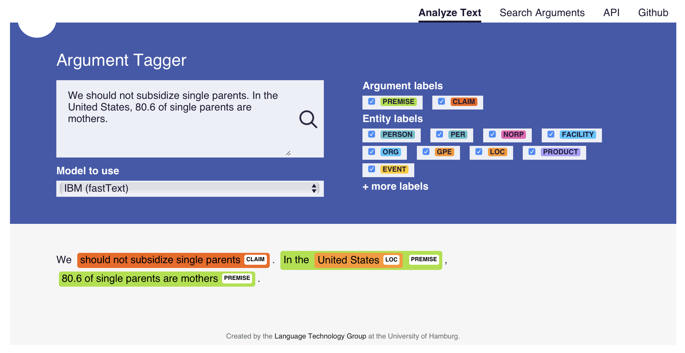

# TARGER: Neural Argument Mining at Your Fingertips

This page contains code of the Web application and web service based on the neural [argument tagger](http://github.com/achernodub/bilstm-cnn-crf-tagger). The figure below illustrates how the sytem looks like: you can enter some text in the input box and detect arguments in it with one of the pre-trained neural models for argument mining. 



This repository shares code and data related to the following paper:

Artem Chernodub, Oleksiy Oliynyk, Philipp Heidenreich, Alexander Bondarenko, Matthias Hagen, Chris Biemann, and Alexander Panchenko (2019): [TARGER: Neural Argument Mining at Your Fingertips](https://www.inf.uni-hamburg.de/en/inst/ab/lt/publications/2019-chernodubetal-acl19demo-targer.pdf). In Proceedings of the 57th Annual Meeting of the Association of Computational Linguistics (ACL'2019). Florence, Italy. 

If you use the demo or would like to refer to it, please cite the paper mentioned above. You can also use the following BibTex information for citation: 

```
@inproceedings{chernodub2019targer,
  title={TARGER: Neural Argument Mining at Your Fingertips},
  author={Chernodub, Artem and Oliynyk, Oleksiy and Heidenreich, Philipp and Bondarenko, Alexander and Hagen, Matthias and Biemann, Chris  and Panchenko, Alexander},
  booktitle={Proceedings of the 57th Annual Meeting of the Association of Computational Linguistics (ACL'2019)},
  year={2019},
  address={Florence, Italy}
}
```

Below you will find instructions on how to run this web application locally. Alternatively you can just access it using the following URL: http://ltdemos.informatik.uni-hamburg.de/targer/. The web application relies on a neural tagging library: http://github.com/achernodub/targer based on PyTorch. You may find it also useful. This library lives in a separate repository from the Web applcation but is also part of the TARGER project.

## Quick run web application with docker
`docker-compose up`
Access the frontend at http://localhost:6001/ and the backend REST API at http://localhost:6000.

## Documentation

* [System architecture](https://github.com/uhh-lt/argument-search-engine/wiki/System-architecture)
* [Installation guide](https://github.com/uhh-lt/argument-search-engine/wiki/Installation-guide)
* [User guide](https://github.com/uhh-lt/argument-search-engine/wiki/User-guide)
